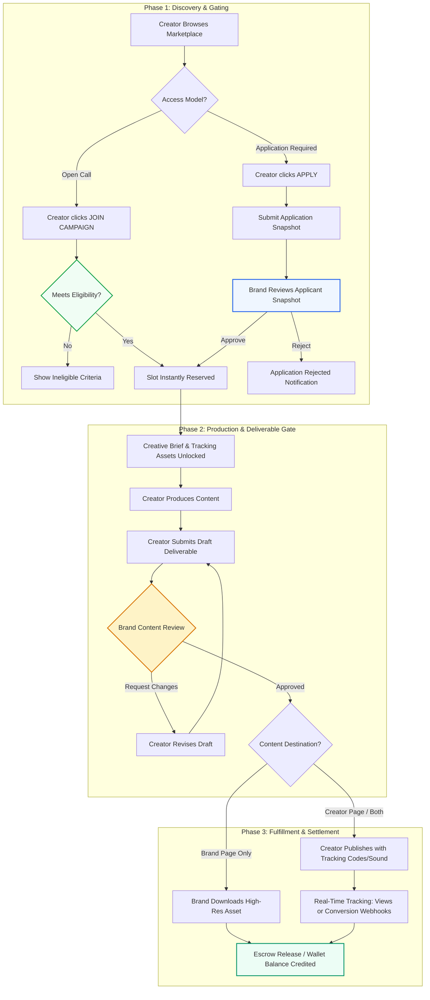
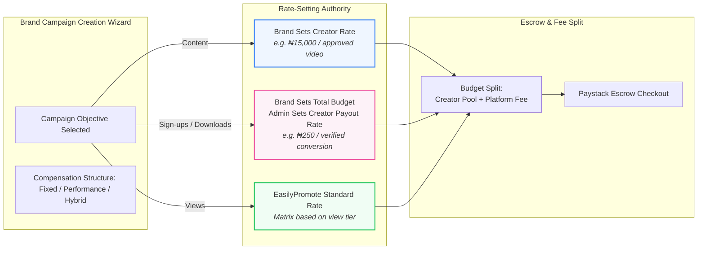
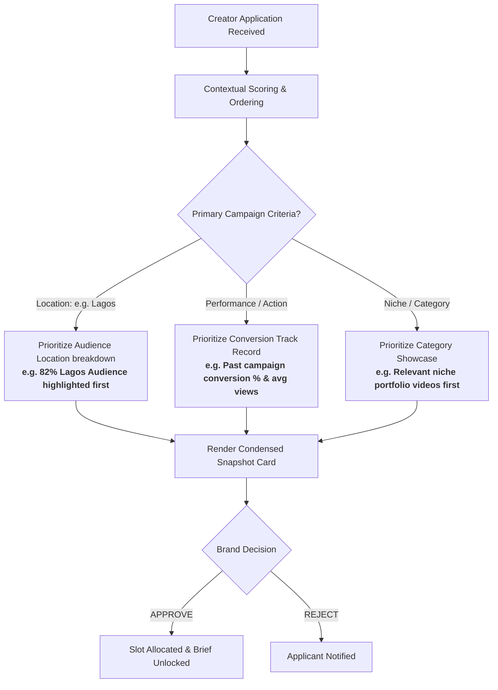
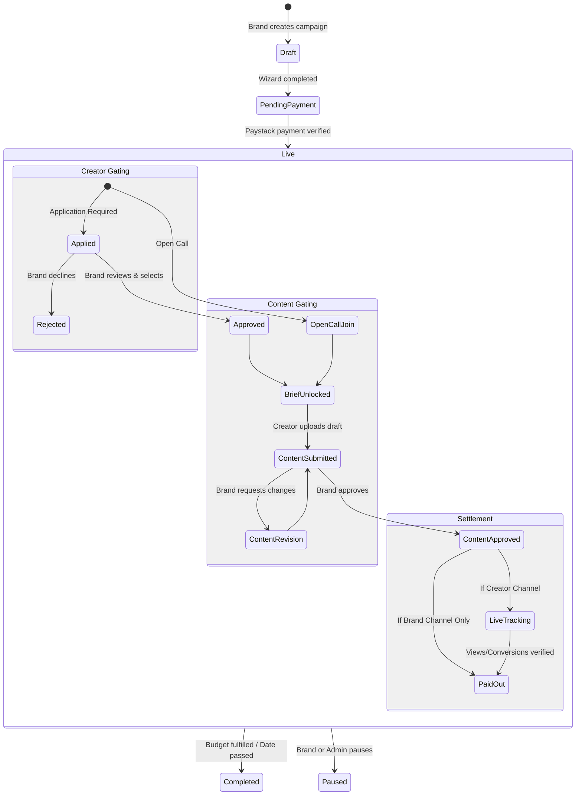

# EasilyPromote Campaign Engine — Flow Diagrams

This document illustrates the end-to-end architecture, lifecycle gates, rate routing, and applicant evaluation flows.

---

## 1. Complete Campaign Lifecycle (Dual-Gate Architecture)

The critical architectural rule: **Creator Approval** (permission to participate) and **Content Approval** (review of created content) are two completely separate gates.

---

## 2. Rate-Setting Authority & Budget Routing by Objective

Different campaign objectives route rate-setting authority to different parties.

---

## 3. Contextual Prioritization in Brand Applicant Review

When a brand reviews creator applications, the view dynamically prioritizes data matching the campaign's targeting criteria.

---

## 4. State Machine: Campaign, Application, and Submission

