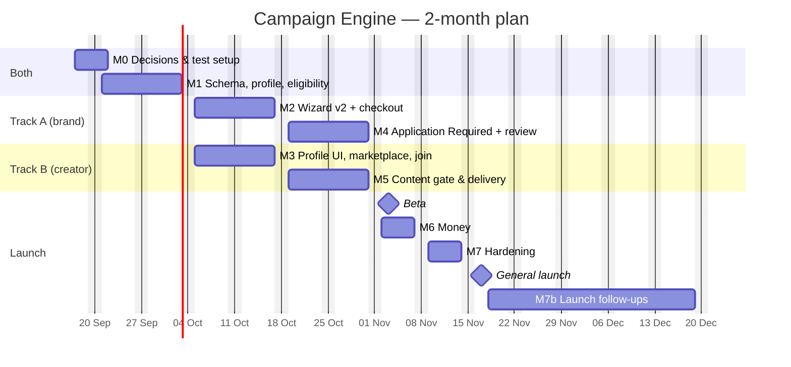
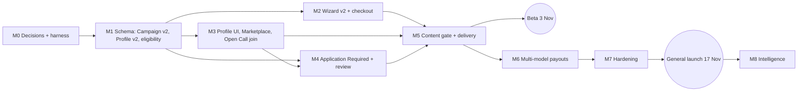

# Campaign Engine — Launch Roadmap & Timeline (Operation Launch Fast)

One document from today to a fully shipped Campaign Engine: what already exists, what we still build, in what order, and by when.

- **Written:** Wed 16 Sep 2026
- **Sources:** the Flow Review (12 sections), [SPEC.md](SPEC.md), [FLOW_DIAGRAMS.md](FLOW_DIAGRAMS.md), tickets 01–09 ([tickets/](tickets/)), [budget-first-plan.md](../budget-first-plan.md), [referral-tracking-plan.md](../referral-tracking-plan.md), and the current code in `Backend/` and `Fontend/apps/web`.
- **Tickets:** [ROADMAP.md](ROADMAP.md) maps tickets 00–11 and their blockers.
- **Plan length:** 2 months — kick-off Thu 17 Sep, general launch **Tue 17 Nov 2026**.

---

## 1. Timeline at a glance (2-month plan)

### What it takes to fit in 2 months

1. **Two engineers full-time from 21 Sep, plus coding agents.** From M2 on, work runs in two parallel tracks. With one engineer this plan does not fit; fall back to ~3.5 months.
2. **Decisions in 3 working days, not 7.** D1–D14 (§4) answered by **Mon 21 Sep**, or the recommended defaults apply automatically.
3. **Some scope moves to right after launch** (§1b). Nothing is dropped; it ships 18 Nov – 18 Dec.

| Milestone | Dates (2026) | Track | Outcome | Tickets |
|---|---|---|---|---|
| **M0 — Lock decisions & groundwork** | Thu 17 – Mon 21 Sep | Both | Decisions answered, test scripts in place, tickets corrected | 00 |
| **M1 — Data foundations** | Mon 21 Sep – Fri 2 Oct | Both | Campaign v2, Creator Profile v2, eligibility service, existing campaigns moved over | 01 (backend), 02 |
| **M2 — Brand creates any campaign** | Mon 5 – Fri 16 Oct | A | Wizard v2: Content / Views / Sign-ups, Fixed / Performance, destination, access, targeting, one checkout | 03 |
| **M3 — Creator discovers & joins** | Mon 5 – Fri 16 Oct | B | Profile v2 screens, Marketplace v2, Open Call join | 01 (UI), 04, 05 |
| **M4 — Application Required** | Mon 19 – Fri 30 Oct | A | APPLY, applicant review with campaign-aware snapshot, APPROVE / REJECT | 06 |
| **M5 — Content gate & delivery** | Mon 19 – Fri 30 Oct | B | Submission → revisions → approval → creator page / brand page / both | 07 |
| 🚀 **Beta** | **Tue 3 Nov** | — | Content + Fixed campaigns for 3–5 invited brands | — |
| **M6 — Money** | Mon 2 – Fri 6 Nov | Both | Fixed pay trigger, wallet breakdown, audit trail (performance payouts already exist) | 08 (remaining), 09 |
| **M7 — Hardening** | Mon 9 – Fri 13 Nov | Both | Full end-to-end runs, production data move, alerts, help pages | — |
| 🚀 **General launch** | **Tue 17 Nov** | — | All brands | — |
| **M7b — Launch follow-ups** | 18 Nov – 18 Dec | Both | Everything in §1b | 10, 11 |
| **M8 — Post-launch intelligence** | Jan – Feb 2027 | — | API audience data, automatic badges, Trending v2, Leads / Sales / Engagement | — |

**There is no slack.** Every milestone is on the critical path. A slip in M1 moves both launches; a slip in either track moves the beta. The beta gets two weeks before general launch instead of five.

### 1b. What moves to launch follow-ups (18 Nov – 18 Dec)

| Moved | At launch instead |
|---|---|
| **Hybrid pay** (base + bonus) | Fixed and Performance only; Hybrid tab hidden in the marketplace |
| Engagement / Leads / Sales / Other objectives | Shown as "Coming soon" in the wizard |
| Trending section | Recommended for You + New |
| Live "about N creators match" count in the wizard | Eligibility is checked when creators join or apply |
| 500 MB file upload for brand-page delivery | Creator shares a download link (Drive / Dropbox / WeTransfer) |
| Automatic unused-budget refunds | Admin issues refunds from the dashboard, logged |
| Brand payment statement | Existing payouts view |
| Admin per-view rate table screen | Existing per-industry rates |
| Load testing | Spot checks on marketplace, join and approve |

## 2. Where we are today (baseline)

A lot of the Flow Review already exists. The tickets were written as if we start from zero, so this is the real starting line.

### Already built — keep and reuse

| Area | What exists | Where |
|---|---|---|
| Views campaigns | Brand buys target views; price from the tier table (admin can override per industry); 30% fee inside budget; slots split the views | `models/Campaign.js`, `config/pricing.js`, `models/Industry.js` |
| **Views rate set by EasilyPromote** (Flow §3) | Done — brands never set per-view price | `config/pricing.js` |
| Sign-up / referral campaigns | `objective: "views" \| "actions"`, referral budget, multiple conversion types, one checkout | `Campaign.referral`, budget-first P1–P5 |
| **Sign-up rate set by admin** (Flow §3) | Done — `PATCH /api/admin/referrals/campaigns/:id/reward`, backlog paid oldest first | `routes/adminReferrals.js` |
| Referral codes + webhooks | Per-creator codes, signed idempotent webhooks, key rotation, connect-before-pay | `ReferralCode`, `ConversionEvent`, `WebhookKey`, `services/conversions.js` |
| Content approval gate (partial) | Submission `new → approved/rejected → awaiting_post → posted → verifying`, appeals, events log | `models/Submission.js`, `routes/submissions.js` |
| Payouts | Weekly per-campaign withdrawals (Friday), ₦2,000 min, 7-day hold, Paystack transfers, admin payout run | `services/withdrawalPayouts.js`, admin `/payout-run` |
| Creator standing | Rank (rank1–5, elite), creator score, completion rate, verified views | `CreatorProfile`, `services/creatorScore.js` |
| Social connections | TikTok and Meta (Instagram/Facebook) OAuth with stats sync | `TikTokConnection`, `MetaConnection`, `routes/tiktok.js`, `routes/meta.js` |
| File storage | S3 presigned uploads, Cloudinary | `routes/upload.js` |

### Not built yet — the actual scope

| Flow Review section | Gap |
|---|---|
| §1 Campaign models | No `content` model; every campaign is views-based with an optional referral add-on |
| §2 Compensation shapes | No Fixed (₦ per approved deliverable) and no Hybrid (base + bonus) |
| §3 Rate authority | Brand-set content rate missing (views + sign-ups are done) |
| §4 Content destination | Not modelled; no asset handover to brand, no usage-rights record |
| §5 Access models | Everything is effectively Open Call (slot claim gated by rank only) |
| §6 Application Required flow | No `CampaignApplication`, no brand applicant review, no "You've been selected" |
| §7 Open Call flow | Exists as slot claim, but without eligibility rules or brief locking |
| §8 Audience targeting | Campaign has `platforms`/`niches` only; no audience location / age / gender |
| §9 Wizard config | Missing objective list, destination, compensation, access, eligibility, rich brief fields (hashtags, sound, reference videos, tone) |
| §10 Marketplace | No Fixed / Performance / Hybrid tabs, no Recommended / Trending / New, no economics-first card |
| §11 Creator profile | No audience demographics, portfolio, legal name/phone privacy split, badges |
| §12 Application snapshot | Does not exist |

### Corrections to the existing tickets

1. **Frontend target is `Fontend/apps/web`**, not `@ep/brand` / `@ep/creator` (those are stale duplicates — see referral-tracking plan). Admin work stays in `apps/admin`.
2. **Ticket 08 is ~80% done.** Referral codes, webhooks, idempotency, atomic pool reservation, sockets and admin reward-setting all shipped. Remaining: views rate-table admin UI polish and linking codes to the new join/approve paths.
3. **Ticket 07 extends the existing `Submission` model** rather than inventing new statuses. Current `new` maps to the ticket's `submitted`; we add `changes_requested` and the brand-page delivery branch.
4. **Ticket 02 must not rename `objective`** (`views | actions`) — live campaigns and the admin panel read it. New fields sit next to it.
5. **SPEC "Out of scope: OAuth analytics" is out of date** — TikTok and Meta OAuth already exist. Audience demographics still start as creator-entered + proof screenshot for launch; API sourcing moves to M8.
6. **No test framework exists.** We follow the budget-first pattern: end-to-end scripts against a throwaway local MongoDB, Paystack stubbed.

---

## 3. Non-negotiable rules (apply to every milestone)

1. **Two gates, never merged.** Creator Approval (can they participate?) lives on `CampaignApplication` / the slot. Content Approval (does the output meet the brief?) lives on `Submission`. No shared status field, no shared endpoint.
2. **Rate authority follows the objective.** Content → brand sets the rate. Sign-ups / downloads → brand sets a budget, admin sets the per-action reward. Views → EasilyPromote price table. The API rejects a brand-supplied rate where the brand doesn't own it.
3. **Pay before live.** Paystack can't hold money, so everything that can block a campaign (connection check, budget ≥ one deliverable, valid targeting) is validated before checkout.
4. **Nothing live breaks.** Every existing views or referral campaign keeps running, paying and withdrawing at every step. Legacy campaigns are migrated to `campaignModel: "performance"`, `performanceMetric: "views"`, `creatorAccess: "open_call"`.
5. **Audience location, not creator location**, drives targeting and "Recommended".
6. **Private data stays private.** Legal name, phone, email and bank details never appear in brand-facing projections.
7. **Existing conventions:** in-app modals (never `alert()` / `window.confirm()`), AGENTS.md UI rules, zod validation, route-handler + `services/` layout, test only against a scratch database.

---

## 4. Decisions to lock in M0 (by Mon 21 Sep)

Each blocks a milestone. Owner: product (Ayanfe) with engineering.

| # | Decision | Recommended default | Blocks |
|---|---|---|---|
| D1 | When is a **Fixed** creator paid: on content approval, or after the post is verified live? | Creator-page / Both: after live post verified. Brand-page only: on content approval. | M5, M6 |
| D2 | Platform fee on Content campaigns: inside the budget (like today) or added on top of the brand's rate? | **On top** — the brand's ₦15,000 is exactly what the creator sees; fee shown separately at checkout | M1, M2 |
| D3 | How many deliverables does a Content campaign buy? | Brand sets rate × number of creators (or deliverables); budget = that product; slots = that number | M1, M2 |
| D4 | **Hybrid** bonus: which metric and cap? | Views bonus from the price table *or* referral bonus via admin reward; bonus pool funded at checkout, capped per creator | M7b |
| D5 | Unused budget (fewer creators approved than paid for, rejected content) | Refund to brand via Paystack at campaign end, minus Paystack fees; admin-issued at launch, automatic in M7b | M6 |
| D6 | Usage rights for "Brand page" / "Both" | Fixed standard licence text shown at join/apply (perpetual, non-exclusive, organic + paid social). Custom terms later | M2, M5 |
| D7 | Audience data source for launch | Creator-entered % + screenshot proof from TikTok/IG analytics; admin spot-check; "Self-reported" label until API data exists | M1, M3 |
| D8 | Targeting: hard filter or ranking signal? | **Location + platform + verification = hard eligibility.** Age, gender, interests = ranking only at launch | M1, M3 |
| D9 | Application SLA | Applications expire after 7 days unreviewed; brand reminded at day 3 | M4 |
| D10 | Content review SLA | Auto-approve after 72h of brand inactivity (protects creators) | M5 |
| D11 | Max revision rounds | 2 change requests, then approve or reject with reason (appealable) | M5 |
| D12 | Brand-page asset delivery | Download link at launch; original file upload (S3, ≤ 500MB) in M7b | M5 |
| D13 | "All creators verified at onboarding" — what does verified mean? | At least one connected (OAuth) social account + admin identity check | M1 |
| D14 | Launch scope | Content + Fixed, Performance (views, sign-ups), both access models, all three destinations. Hybrid and new metrics in M7b | Launch plan |

---

## 5. Milestones in detail

### M0 — Lock decisions & groundwork · 17 – 21 Sep

- [ ] Answer D1–D14 (§4); write the answers into [SPEC.md](SPEC.md)
- [ ] Update tickets 01–09: `apps/web` target, ticket 08 remaining scope, ticket 07 built on `Submission`
- [ ] `Backend/scripts/e2e/` harness: scratch MongoDB, Paystack stub, seeded brand + creators (reuse `seedTestCreator.js`, `testFlowAuditFixes.js`)
- [ ] Glossary in `CONTEXT.md`: campaign model, compensation shape, rate authority, destination, access model, Creator Approval, Content Approval
- [ ] Create branch `feature/campaign-engine`

**Exit:** every decision answered; e2e script runs one legacy views campaign from create → pay → claim → submit → approve green.

---

### M1 — Data foundations · 21 Sep – 2 Oct (both engineers)

**Ticket 02 — Campaign v2 schema & rate authority**
- [ ] Add to `Campaign`: `campaignModel` (`content | performance`), `objective2` list (Content / Views / Engagement / Downloads / Sign-ups / Leads / Sales / Other — name to agree, must not collide with `objective`), `contentDestination` (`creator_page | brand_page | both`), `creatorAccess` (`open_call | application_required`)
- [ ] `compensation`: `shape` (`fixed | performance | hybrid`), `basePay`, `deliverablesCount`, `performanceMetric`, `performanceRate`, `rateAuthority` (`brand | admin | platform`), `bonusPool`
- [ ] `audienceTargeting`: locations (state + min %), age ranges, genders, interests, platforms
- [ ] `creatorEligibility`: min followers, min engagement %, categories, verified-only, min rank, required badges
- [ ] Brief fields: do's, don'ts, hashtags, sound link, reference videos, tone, key messages, product info, approval requirements
- [ ] `services/rateAuthority.js`: one function that says who may set which rate for a given objective; used by create, edit and admin routes
- [ ] Budget calculator service: content (rate × deliverables + fee), views (price table), sign-ups (budget), hybrid (base + bonus pool); single source for wizard and checkout
- [ ] Migration script: legacy campaigns → `performance` / `views` / `open_call`; dry run against a production snapshot copy

**Ticket 01 (backend) — Creator Profile v2**
- [ ] `CreatorProfile`: `legalName`, `phone`, `location` (private vs public flags), `categories`, `audienceDemographics` (locations %, age %, gender %, `source: self_reported | api`, `proofUrl`, `updatedAt`), `portfolio[]`, `verified`, `badges[]`, cached `stats` (followers, avg views, engagement, past campaigns, cumulative campaign views)
- [ ] Validation: each breakdown sums to ≤ 100%; top 5 locations
- [ ] `GET/PUT /api/creators/profile/me` extended; `GET /api/creators/:id` brand-safe projection (no legal name, phone, email, bank)
- [ ] Stats snapshot job pulling followers / views from TikTok and Meta connections where connected

**Shared**
- [ ] `services/eligibility.js`: `evaluate(creatorProfile, campaign) → { eligible, failures[], matchScore }` — hard rules per D8, match score uses audience location share for "Recommended" and the snapshot

**Exit:** migration dry run leaves every live campaign's payouts identical; e2e creates one campaign of each model through the API; eligibility unit cases pass (Abuja creator with 80% Lagos audience matches a Lagos campaign; Lagos creator with 10% Lagos audience doesn't).

---

### M2 — Brand creates any campaign · 5 – 16 Oct (track A)

**Ticket 03 — Wizard v2** (`apps/web/.../brand/create-campaign`)
- [ ] Step 1 **Objective & model** — Content / Views / Engagement / Downloads / Sign-ups / Leads / Sales / Other (unsupported ones shown as "Coming soon" at beta)
- [ ] Step 2 **Destination & access** — creator page / brand page / both (with usage-rights text, D6); Open Call vs Application Required with plain explanations
- [ ] Step 3 **Targeting & eligibility** — audience location %, age, gender, interests, platform; min followers, engagement, categories, verified, rank/badges _(live "≈ N creators match" count → M7b)_
- [ ] Step 4 **Compensation & budget** — fields change by rate authority: Content → brand enters ₦/deliverable × count; Sign-ups → budget only, "Reward set by our team"; Views → price from table _(Hybrid → M7b)_. Summary: creator budget, performance budget, platform fee, total
- [ ] Step 5 **Brief** — brief, do's/don'ts, hashtags, sound, reference videos, tone, key messages, product info, approval requirements
- [ ] Checkout: extend the existing single Paystack checkout to content totals; keep connect-before-pay for sign-up objectives
- [ ] Brand campaign page shows the new config and "Being set by our team" where applicable

**Exit:** a brand can create and pay for a Content/Fixed, Views and Sign-ups campaign in the web app; amounts match the budget service to the kobo.

---

### M3 — Creator discovers & joins · 5 – 16 Oct (track B)

**Ticket 01 (UI) — Profile v2** (`apps/web/.../creator`)
- [ ] Profile sections: basic info (private fields marked), social accounts, portfolio (add/reorder/remove), audience demographics with proof upload, categories, verified badge, rank/badges (read-only)
- [ ] Profile completeness prompt in the creator dashboard ("Add your audience to see more campaigns")

**Ticket 04 — Marketplace v2**
- [ ] Tabs: All / Fixed Pay / Performance _(Hybrid tab appears in M7b)_
- [ ] Sections: Recommended for You (eligibility `matchScore`), New (created date), _(Trending → M7b)_
- [ ] Card leads with economics: `₦15,000 / APPROVED VIDEO`, `₦250 / DOWNLOAD`, `₦5 / 1,000 VIEWS`, hybrid `₦5,000 + bonus`; then platform, location, access badge (Open Call 🟢 / Application Required 🔵), CTA (JOIN CAMPAIGN / APPLY)
- [ ] No sub-category labels anywhere ("UGC", "Download campaign")
- [ ] Ineligible campaigns shown with the reason ("Needs 5,000+ followers") rather than hidden — decide in M0 if needed

**Ticket 05 — Open Call join**
- [ ] `POST /api/campaigns/:id/join`: eligibility check → atomic slot reservation (reuse `/slots/claim` atomics) → referral code if sign-up objective → notification
- [ ] Ineligible response lists each failed criterion
- [ ] Brief locking: public summary before join; full brief, references, hashtags, tracking code after join
- [ ] Remaining slots / budget pushed over Socket.IO

**Exit:** two creators race for the last slot, exactly one wins; an ineligible creator sees why; a joined creator sees the full brief and (for sign-ups) their code.

---

### M4 — Application Required · 19 – 30 Oct (track A)

**Ticket 06**
- [ ] `CampaignApplication` model: campaign, creator, status (`pending | approved | rejected | withdrawn | expired`), optional pitch, `applicantSnapshot` frozen at apply time, reviewedAt, reason
- [ ] `POST /api/campaigns/:id/apply` (eligibility enforced), `DELETE` to withdraw
- [ ] Brand applicant list on campaign page: count badge, filters (pending / approved / rejected), sort by match score
- [ ] **Application snapshot** drawer (Flow §12): photo, name, ✓ Verified, location; platform + followers; categories; audience snapshot (top location %, top age %, gender %); performance snapshot (avg views, engagement %, past campaigns, cumulative views); portfolio thumbnails; badge + completion %; APPROVE / REJECT
- [ ] **Contextual ordering:** location-targeted → matching location % first; performance campaign → performance block first; category campaign → matching portfolio items first. One pure function `orderSnapshot(snapshot, campaign)` so it's testable
- [ ] Approve: reserve slot atomically (fails cleanly if full), unlock brief, referral code, "You've been selected" notification + email
- [ ] Reject: optional reason, notification; expiry job per D9
- [ ] Creator "My applications" list with status

**Exit:** apply → brand approves → brief unlocks; approving beyond slot count is refused; no code path lets an application status change a submission, or the reverse.

---

### M5 — Content gate & delivery · 19 – 30 Oct (track B)

**Ticket 07** — extends `Submission`
- [ ] Add `changes_requested` status, `revisionRound`, per-round feedback history; cap per D11
- [ ] Brand review drawer: inline video, caption, brief checklist side by side; APPROVE / REQUEST CHANGES / REJECT
- [ ] Branch on `contentDestination` after approval:
  - **Creator page:** `awaiting_post` → creator submits live URL (with required hashtags/code) → `posted` → `verifying` → `completed`
  - **Brand page:** creator shares a download link (D12) → brand downloads → `delivered` → `completed`
  - **Both:** both steps; usage-rights acceptance recorded on the submission
- [ ] Auto-approve job per D10; notifications for every transition
- [ ] Existing views campaigns keep their current path untouched

**Exit:** each of the three destinations runs end-to-end in the e2e script; a legacy views submission still flows exactly as before.

---

### 🚀 Launch Fast beta · Tue 3 Nov

Scope (D14): Content campaigns with Fixed pay, Open Call + Application Required, all three destinations, invited brands only (feature flag per brand). Views and sign-up campaigns continue as today.

For beta, Fixed payouts use the existing withdrawal pipeline: approved/delivered content credits the creator's campaign balance with `basePay` (payout trigger from M6 lands in the first beta week; until then admin confirms credits from the payout run page).

- [ ] Feature flag `campaignEngineV2` on `BusinessProfile`
- [ ] 3–5 beta brands onboarded, 20–50 creators with complete profiles
- [ ] Daily check of beta campaigns in admin

---

### M6 — Money · 2 – 6 Nov (both engineers)

**Ticket 09 + remaining 08**
- [ ] Payout triggers in one service: **Fixed** → per D1; **Performance** → per verified view milestone (existing) or conversion (existing referral reserve); _(Hybrid → M7b)_
- [ ] Ledger rows tagged `base | performance | referral | fee | refund`, all tied to campaign + slot/submission; atomic reservation from each pool so no campaign overspends
- [ ] Creator wallet: per campaign, base vs performance vs referral, hold, payout day
- [ ] Admin-issued refund of unused budget per D5, logged
- [ ] Admin: content-campaign overview, stuck-payment queue
- [ ] Audit log entries for every escrow movement (reuse `AdminActivity` / `SubmissionEvent` patterns)

**Exit:** reconciliation script — for every campaign, paid in = creator payouts + fees + refunds + remaining pools, to the kobo — passes on the e2e data and on the beta campaigns.

---

### M7 — Hardening & general launch · 9 – 13 Nov, launch Tue 17 Nov

- [ ] Full e2e suite: every model × shape × destination × access combination that is enabled
- [ ] Run the migration on production (after a snapshot), verify live campaigns
- [ ] Spot checks on marketplace and join/approve speed (API is ~600ms away — keep round trips per screen low)
- [ ] Error alerts on payout failures, webhook failures, stuck submissions
- [ ] Brand and creator help pages; admin runbook for rewards, refunds, disputes
- [ ] **Tue 17 Nov:** remove the feature flag; all brands

---

### M7b — Launch follow-ups · 18 Nov – 18 Dec

- [ ] **Hybrid pay:** wizard fields, bonus pool at checkout, base on Fixed trigger + bonus on performance, marketplace Hybrid tab (D4)
- [ ] Engagement / Leads / Sales / Other objectives out of "Coming soon" where tracking exists
- [ ] Trending section (joins + applications in the last 72h)
- [ ] Live "≈ N creators match" count in the wizard
- [x] ~~Original file upload for brand-page delivery (S3 multipart, ≤ 500MB)~~ Dropped 17 Sep: storage is Cloudinary (100 MB max); delivery stays a download link
- [ ] Automatic unused-budget refunds at campaign end
- [ ] Brand statement: deliverables paid, performance paid, fee, refund due
- [ ] Admin per-view rate table screen
- [ ] Load test on marketplace, join and approve

**Exit:** reconciliation passes with Hybrid campaigns included. Holiday freeze 21 Dec – 4 Jan.

---

### M8 — Post-launch intelligence · Jan – Feb 2027

- [ ] Audience demographics pulled from TikTok / Instagram APIs where scopes allow; "Verified audience" label replaces "Self-reported"
- [x] Automated badges: Top Creator, High Performer, Reliable Creator, Campaign Pro from creator score, completion rate and brand ratings (add a post-campaign brand rating) — built: brand ratings (SPEC D24), badge rules with minimum samples and hysteresis, admin overrides, pre-existing badges kept for review (D25)
- [ ] Recommended v2 using past campaign results; Trending weighted by fill speed
- [ ] New performance metrics: Clicks, Leads, Sales, Engagement (clicks via tracked links; leads / sales via the existing webhook contract)
- [ ] Age / gender / interests as hard filters once data is trustworthy
- [ ] Custom usage-rights terms per campaign

---

## 6. Flow Review coverage map

| Flow Review section | Milestone(s) | Status today |
|---|---|---|
| 1. Campaign models | M1, M2 | Views/actions only |
| 2. Compensation shapes | M1, M2, M6 | Performance only |
| 3. Rate authority | M1 (content), done (views, sign-ups) | 2 of 3 done |
| 4. Content destination | M1, M2, M5 | Missing |
| 5. Access models | M1, M3, M4 | Open Call only (implicit) |
| 6. Application Required flow | M4, M5, M6 | Missing |
| 7. Open Call flow | M3, M5, M6 | Partial (slot claim) |
| 8. Audience targeting | M1, M2, M3, M8 | Missing |
| 9. Campaign creation config | M1, M2 | Partial |
| 10. Creator marketplace | M3, M8 | Old marketplace |
| 11. Creator profile | M1, M3, M8 | Basic profile |
| 12. Profile vs application view | M4 | Missing |

---

## 7. Dependencies

---

## 8. Risks

| Risk | Impact | Mitigation |
|---|---|---|
| Decisions in §4 slip past 21 Sep | Every date moves by the slip | Recommended defaults are pre-filled; ship with defaults if no answer by the deadline |
| Migration breaks a live views/referral campaign | Creators or brands lose money / trust | Additive fields only, dry run on a snapshot copy, reconciliation script before and after |
| Self-reported audience data is inaccurate | Brands target the wrong creators | Proof screenshots, admin spot checks, "Self-reported" label, API sourcing in M8 |
| Brands don't review content or applications | Creators stuck, unpaid | Expiry (D9) and auto-approve (D10) jobs, reminders |
| Paystack can't hold money | Refunds are the only reverse path | Validate everything before checkout; refunds need admin approval and are logged |
| Large asset uploads for brand-page delivery | Slow or failed uploads on mobile | S3 presigned multipart uploads, resumable, size limit per D12 |
| Only one engineer available | Plan does not fit in 2 months | Confirm two engineers by 21 Sep, or move general launch to early January |
| No slack anywhere | Any slip moves both launches | Friday check against exit criteria; cut more from §1b-style items first, never from money correctness |
| Two-week beta is short | Fewer real campaigns before launch | Beta brands run 7-day campaigns; daily admin review |
| No automated test framework | Regressions in money flows | e2e scripts per milestone + reconciliation script as the release gate |

---

## 9. Definition of done (every ticket)

- Works in `Fontend/apps/web` (brand + creator) and `apps/admin` where relevant; `npx tsc --noEmit` clean
- e2e script for the ticket passes against a scratch MongoDB with Paystack stubbed
- Existing views and referral campaigns re-run green in the same script
- Brand-facing responses contain no private creator fields
- Confirmations use in-app modals; UI follows AGENTS.md and `designsystem.md`
- Notifications (in-app + socket, email where noted) for every state change a user must act on
