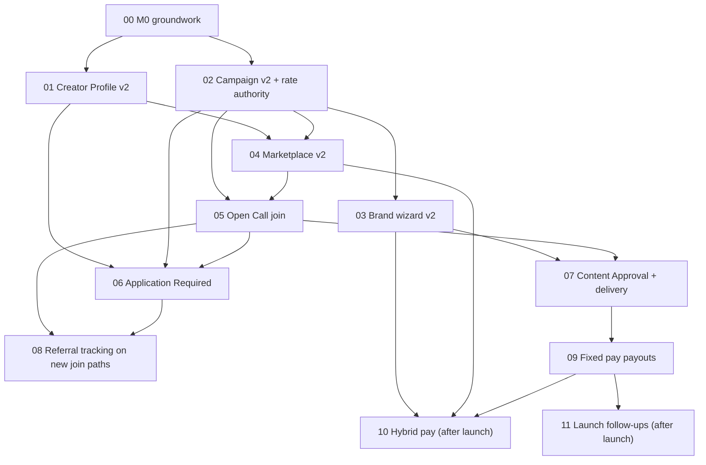

# Campaign Engine — Ticket Map

Dates, scope trade-offs and milestone detail live in [LAUNCH_ROADMAP.md](LAUNCH_ROADMAP.md). Product decisions live in [SPEC.md](SPEC.md). The working copy of the tickets is `.scratch/campaign-engine/issues/`; [tickets/](tickets/) mirrors it.

| # | Ticket | Blocked by | Milestone |
|---|---|---|---|
| 00 | [M0 groundwork](tickets/00-m0-groundwork.md) | — | M0 · 17 – 21 Sep |
| 01 | [Creator Profile v2](tickets/01-creator-profile-audience.md) | 00 | M1 data, M3 screens |
| 02 | [Campaign v2 + rate authority](tickets/02-campaign-schema-and-rates.md) | 00 | M1 · 21 Sep – 2 Oct |
| 03 | [Brand wizard v2](tickets/03-brand-campaign-wizard-v2.md) | 02 | M2 · track A · 5 – 16 Oct |
| 04 | [Marketplace v2](tickets/04-creator-marketplace-v2.md) | 01, 02 | M3 · track B · 5 – 16 Oct |
| 05 | [Open Call join](tickets/05-open-call-join-flow.md) | 02, 04 | M3 · track B · 5 – 16 Oct |
| 06 | [Application Required](tickets/06-application-required-and-review.md) | 01, 02, 05 | M4 · track A · 19 – 30 Oct |
| 07 | [Content Approval + delivery](tickets/07-content-submission-and-approval.md) | 03, 05 | M5 · track B · 19 – 30 Oct |
| 08 | [Referral tracking on new join paths](tickets/08-admin-rates-and-webhooks.md) | 05, 06 | M6 · 2 – 6 Nov |
| 09 | [Fixed pay payouts](tickets/09-multi-model-payout.md) | 07 | M6 · 2 – 6 Nov |
| 10 | [Hybrid pay](tickets/10-hybrid-pay.md) | 03, 04, 09 | M7b · after launch |
| 11 | [Launch follow-ups](tickets/11-launch-follow-ups.md) | launch | M7b · after launch |
